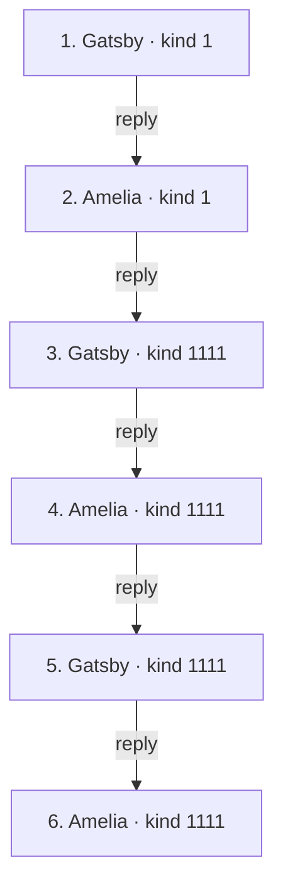
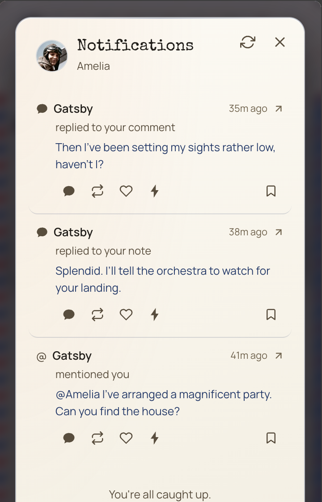
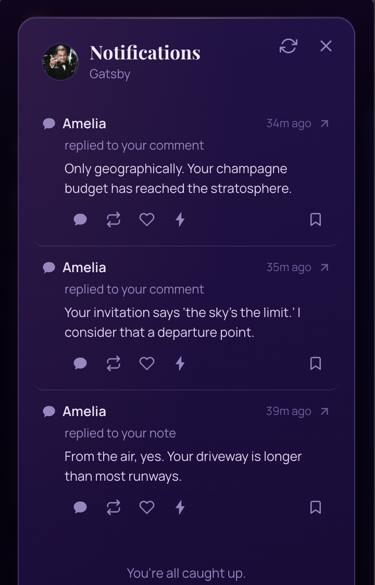

# PR evidence: one conversation across two event kinds

Notifications now find both kind-1 replies and kind-1111 comments, including replies whose root belongs to another participant. Direct comment replies are labeled by the immediate parent: “replied to your note” or “replied to your comment.” The outside-network group remains accessible even when it contains every notification.

## Exact posted conversation

The following chain was retrieved from public relays on September 17, 2026. All six event signatures were verified, and every reply’s parent reference matches the preceding event. Times are America/New_York (EDT). Display names follow the supplied account screenshots; Gatsby’s initial Nostr mention is displayed as @Amelia below. All other message text is reproduced as posted.

| # | Time (EDT) | Author | Event kind | Replies to | Exact message |
|---|---|---|---|---|---|
| [1](https://jumble.social/notes/nevent1qvzqqqqqqypzqz2urk80h4yep0uhl5ds77ghvvgjvcjaex46f9jm5xdt7z3e8etaqyv8wumn8ghj7un9d3shjtnndehhyapwwdhkx6tpdsqzpsf2lds50l50hfmwn7cs32r6a8f5qsgjzkd8ek7pj5cjmpkwu2fmvnj0g2) | 04:29:50 | Gatsby | `1` | Thread parent | @Amelia I’ve arranged a magnificent party. Can you find the house? |
| [2](https://jumble.social/notes/nevent1qvzqqqqqqypzq5fywhdqy26ewdcrrlg4k9ppv8jwvtssf4r99t4j5rvru6kqq87wqyv8wumn8ghj7un9d3shjtnndehhyapwwdhkx6tpdsqzql3g5d488zkrsy44q8uu64d6y2y3qfnefs9xjjd636u9z2rpx8gzj5h045) | 04:30:05 | Amelia | `1` | #1 | From the air, yes. Your driveway is longer than most runways. |
| [3](https://jumble.social/notes/nevent1qvzqqqqy2upzqz2urk80h4yep0uhl5ds77ghvvgjvcjaex46f9jm5xdt7z3e8etaqyv8wumn8ghj7un9d3shjtnndehhyapwwdhkx6tpdsqzq8rdegd83n7udl25x89rms3heg0un55jrfcq5v75jfpu0u8r2vkwpkgnna) | 04:32:49 | Gatsby | `1111` | #2 | Splendid. I’ll tell the orchestra to watch for your landing. |
| [4](https://jumble.social/notes/nevent1qvzqqqqy2upzq5fywhdqy26ewdcrrlg4k9ppv8jwvtssf4r99t4j5rvru6kqq87wqyv8wumn8ghj7un9d3shjtnndehhyapwwdhkx6tpdsqzqj8l60kxxardp97q6rdw2etsq7yxfnv407z789v3t67yvy8e2s7xye2kr9) | 04:34:52 | Amelia | `1111` | #3 | Your invitation says ‘the sky’s the limit.’ I consider that a departure point. |
| [5](https://jumble.social/notes/nevent1qvzqqqqy2upzqz2urk80h4yep0uhl5ds77ghvvgjvcjaex46f9jm5xdt7z3e8etaqyv8wumn8ghj7un9d3shjtnndehhyapwwdhkx6tpdsqzpxf6j4z24dce834l3zl93sw32eqggugu3wgg66qfq2lzv2pmdeesgf6y7l) | 04:35:12 | Gatsby | `1111` | #4 | Then I’ve been setting my sights rather low, haven’t I? |
| [6](https://jumble.social/notes/nevent1qvzqqqqy2upzq5fywhdqy26ewdcrrlg4k9ppv8jwvtssf4r99t4j5rvru6kqq87wqyv8wumn8ghj7un9d3shjtnndehhyapwwdhkx6tpdsqzqjwxcy2ewwh5q9eql9qgvdhmjawczhkypfa06h80qdf64cwmqh9u64mjc3) | 04:35:37 | Amelia | `1111` | #5 | Only geographically. Your champagne budget has reached the stratosphere. |

## Threading evidence

- Event 1 is the kind-1 thread parent, with a mention of Amelia and no reply reference.
- Event 2 is a kind-1 reply whose root-marked `e` tag points to event 1. For a direct reply to the root, that tag also identifies its immediate parent.
- Event 3 switches to kind 1111. Its uppercase `E` points to event 1, `K` is `1`, its lowercase `e` points to event 2, and `k` is `1`.
- Events 4–6 remain kind 1111. Each retains event 1 as `E` with `K: 1`, while its lowercase `e` points to the immediately preceding comment and `k` is `1111`.
- Every kind-1111 event names Gatsby in uppercase `P` as the root author and the immediate parent’s author in lowercase `p`. There is no forced kind-1 reply to a kind-1111 comment in this demo.

## What the screenshots demonstrate

The supplied Damus and Wisp screenshots show events 1 and 2. Sidecar’s notification screenshots collectively show all six: Amelia receives events 1, 3, and 5; Gatsby receives events 2, 4, and 6. These are account-specific notification lists, not a single full-thread view.

The updated Sidecar screenshots confirm the corrected labels. Amelia sees event 1 as “mentioned you,” event 3 as “replied to your note,” and event 5 as “replied to your comment.” Gatsby sees event 2 as “replied to your note,” and events 4 and 6 as “replied to your comment.” Amelia’s self-mention also resolves to @Amelia with the name-resolution fix already merged in PR #327.

| Amelia: events 5, 3, 1 (newest first) | Gatsby: events 6, 4, 2 (newest first) |
|---|---|
|  |  |

## Event IDs

1. Gatsby: `c12afb6147fe8fba76e9fb108a87ae9d3404112159a7cdbc195312d86cee293b`
2. Amelia: `7e28a36a738ac3812b501f9cd55ba22891026794c0a6949ba8eb851286131d02`
3. Gatsby: `1c6dca1a78cfdc6fd5431ca3dc237ca1fc9d2921a700a33d49243c7f0e3532ce`
4. Amelia: `48ffd3ec63746d097c0d0dae56570078864cd957f85e395915ebc4610f9543c6`
5. Gatsby: `993a9544aab7193c6bf88be58c1d1564084711c8b908d680902be26283b6e730`
6. Amelia: `49c6c115973af401720f9408636fb975d815ec40a7afd5cef0353aae1db05cbc`
